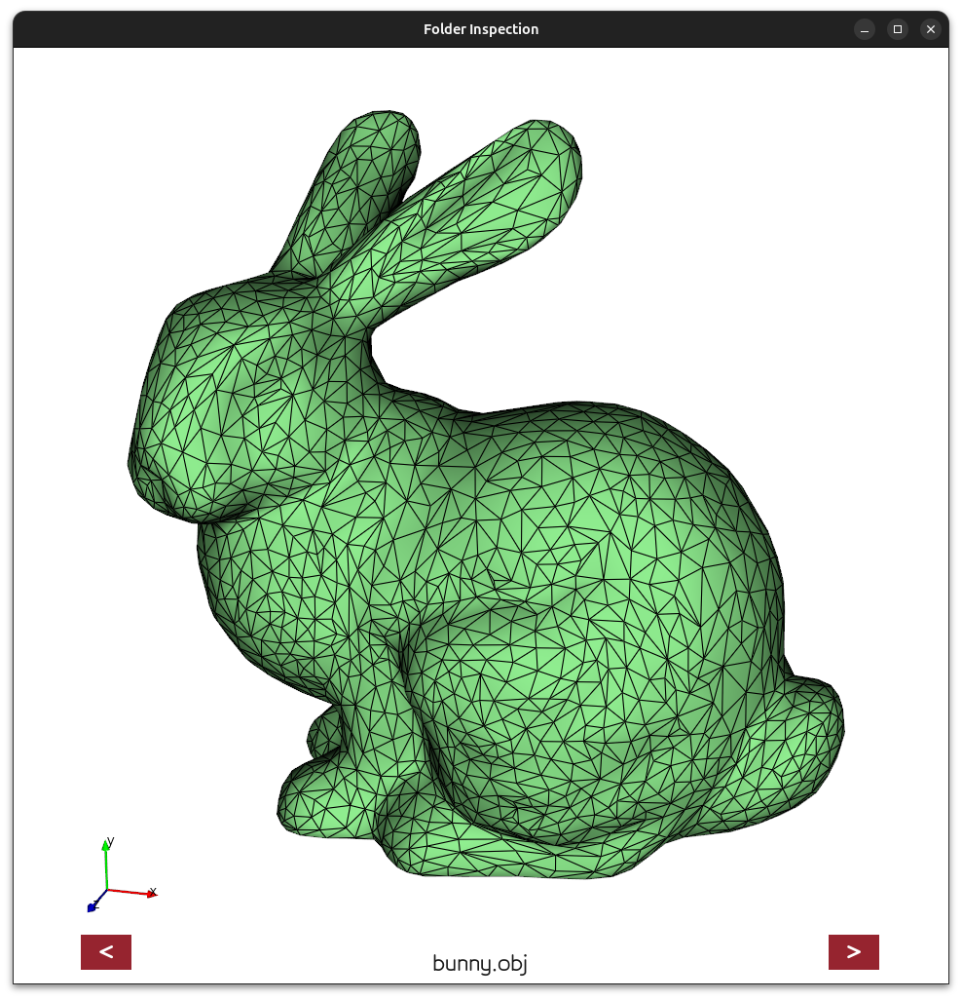
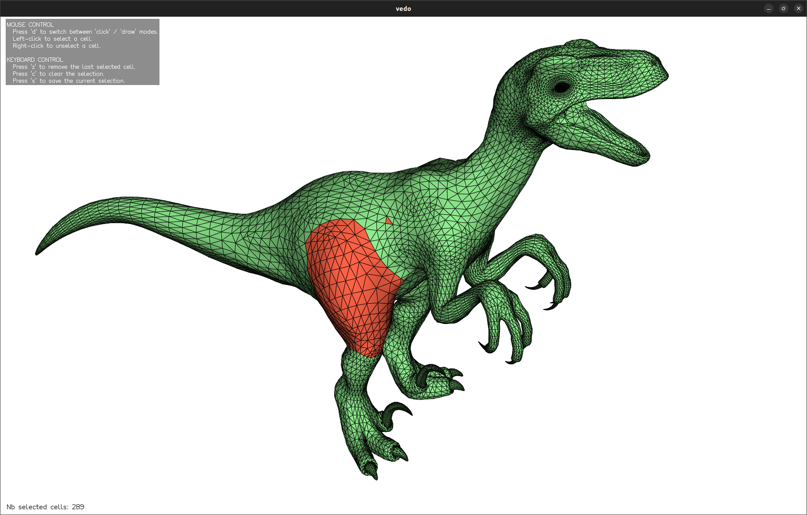
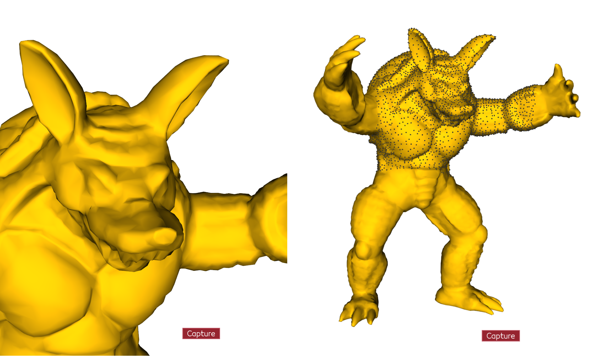

# Vedo Toolkit

A Python toolbox based on [vedo](https://github.com/marcomusy/vedo) for 3D objects visualization and manipulation.

## Installation

```bash
git clone https://github.com/RobinEnjalbert/vedoTk.git
cd vedoTk
pip install .
```


## Usage

# Folder inspection

This tool allows you to easily explore the mesh files contents in a repository. 
The window displays the loaded meshes one by one, and you can switch between files with buttons.
```python
from vedoTk import FolderInspection
FolderInspection('examples/resources')
```

See `examples/folder_inspection.py`.


# Mesh selection

This tool allows you to easily select cells of a surface mesh with the mouse.
The indices and positions can be saved in a `.npy` file.
```python
from vedoTk import MeshSelection
MeshSelection('examples/resources/raptor.obj').launch()
```

See `examples/mesh_selection.py`.


## Visible points

This tool allows you to extract the visible points of a Mesh depending on the virtual camera parameters.
This tool should be used when the extraction is done offscreen (otherwise, use `vedo.visible_pints`).
```python
from vedo import Mesh
from vedoTk import VisiblePoints
VisiblePoints(Mesh('examples/resources/armadillo.obj')).extract()
```

See `examples/visible_points.py`.