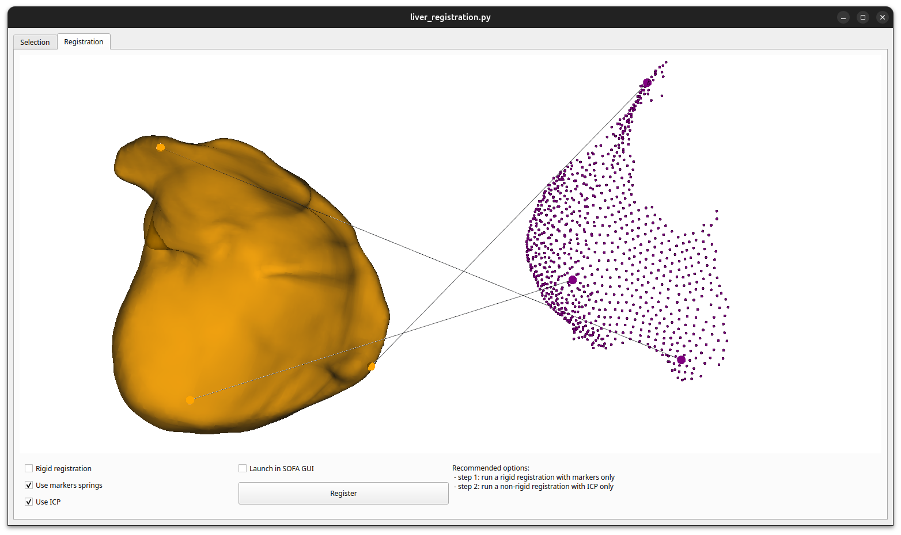

# Vedo Toolkit

A Python toolbox based on [vedo](https://github.com/marcomusy/vedo) for 3D objects visualization and manipulation.

## Installation

```bash
# Option 1 (USERS): install with pip
$ pip install git+https://github.com/RobinEnjalbert/vedoTk.git

# Option 2 (DEVS): install as editable
$ git clone https://github.com/RobinEnjalbert/vedoTk.git
$ cd vedoTk
$ pip install -e .
```


## Usage

### Folder inspection

This tool allows you to easily explore the mesh files contents in a repository. 
The window displays the loaded meshes one by one, and you can switch between files with buttons.
```python
from vedoTk import FolderInspection
FolderInspection(path='examples/resources', extension='.obj')
```

See `examples/folder_inspection.py`.


### Mesh selection

This tool allows you to easily select vertices from a surface mesh with the mouse.
The indices and positions can be saved in a `.npy` file.
```python
from vedoTk import MeshSelection
plt = MeshSelection(mesh='examples/resources/raptor.obj')
plt.launch()
plt.save('selection.npy')
```

See `examples/mesh_selection.py`.


### Non-rigid registration

This tool allows you to compute a non-rigid registration between a source and a target mesh using markers and ICP.
The registration requires SOFA bindings.
```python
from vedoTk import register
register(source=vedo_source_mesh, target=vedo_target_mesh)
```

See `examples/liver_registration.py`.